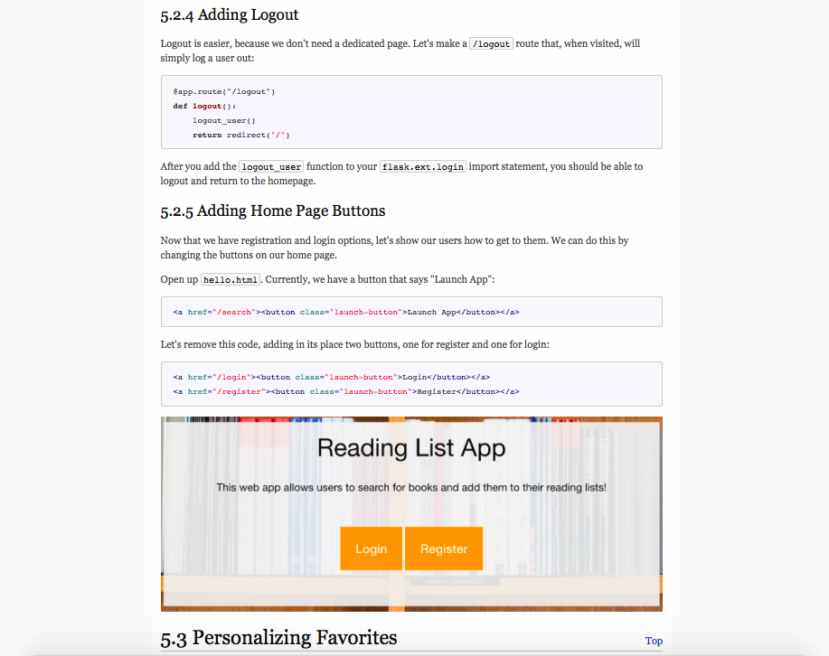

# DevFest Web Development Track
## An open-source, self-paced, and project-motivated web development curriculum. Live at [learn.devfe.st/webdev](http://learn.devfe.st/webdev).

Written and developed by [Raymond Xu](http://www.raymondxu.io), [Matt Piccolella](http://mattpic.com), [Dan Schlosser](http://schlosser.io), and [ADI](http://www.adicu.com).



## Developing
```bash
make
open output.html
```

## Educational Methodology
[Rethinking Education at DevFest](https://medium.com/stories-from-adi/rethinking-education-at-devfest-d5fac7c303be#.hpdwzgu2o)

[Why We Do DevFest](https://medium.com/stories-from-adi/why-we-do-devfest-10bfabdcd66f)

[5 Steps for Effective Education at Hackathons](http://www.raymondxu.io/hackcon16.pdf)
